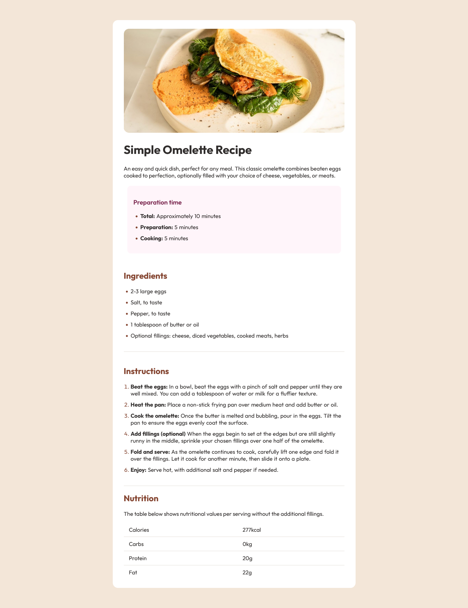

# Frontend Mentor - Recipe page solution

This is a solution to the [Recipe page challenge on Frontend Mentor](https://www.frontendmentor.io/challenges/recipe-page-KiTsR8QQKm). Frontend Mentor challenges help you improve your coding skills by building realistic projects.

## Table of contents
  - [The challenge](#the-challenge)
  - [Screenshot](#screenshot)
  - [Links](#links)
- [My process](#my-process)
  - [Built with](#built-with)
  - [Continued development](#continued-development)

### The challenge

Your challenge is to build out this recipe page and get it looking as close to the design as possible.

You can use any tools you like to help you complete the challenge. So if you've got something you'd like to practice, feel free to give it a go.

Download the starter code and go through the README.md file. This will provide further details about the project. The style-guide.md file is where you'll find colors, fonts, etc.

### Screenshot

### Links

- Solution URL: https://github.com/judeze1/recipe-page
- Live Site URL: https://fastidious-recipe-page.netlify.app/

## My process
Worked on Desktop first view down to Mobile version, structured my HTML tags before going down to css and it was fast and cool.

### Built with
- Semantic HTML5 markup
- CSS custom properties
- CSS Tables
- Desktop-first workflow

### Continued development
To get better at frontend development.
